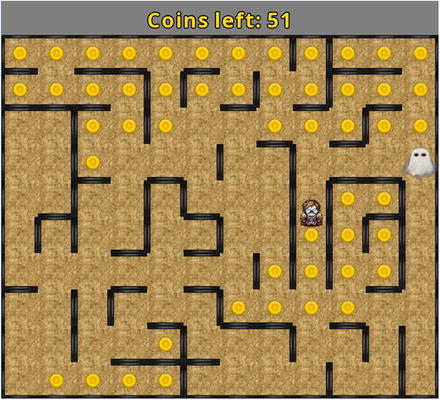

# Game: Maze Runman

Maze Runman is an action game in which the main character, referred to as the hero, races through a maze attempting to collect all the coins before being captured by a ghost.

## Controls

- Up, Down, Left and Right keys: moves hero.

## Setup

- **Java** 8
- **Gradle** Wrapper 6.7.1
- **LigGDX** 1.9.13: https://github.com/libgdx/libgdx
- **GDX Liftoff** 1.9.13: https://github.com/tommyettinger/gdx-liftoff

## Disclaimer

This "framework" is the result of reading, studying and learning the examples shown in the book "**Java Game Development with LibGDX**" by the author Lee Stemkoski.

- **Book site**: https://www.apress.com/gp/book/9781484233238
- **Source-code**: https://github.com/Apress/java-game-dev-LibGDX